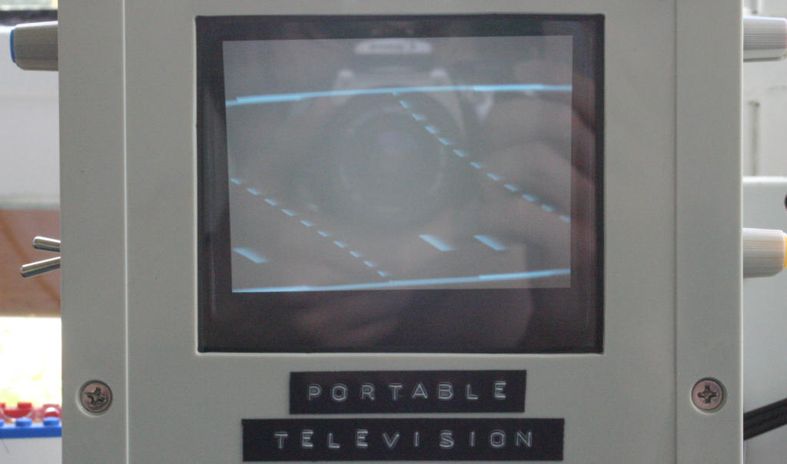

Welcome! On this website, you can find links to my electronics projects. If you want to make any of these yourself, you can have the PCBs manufactured by a fabricator such as [JLCPCB](https://jlcpcb.com/), [Elecrow](https://www.elecrow.com/) or [PCBWay](https://www.pcbway.com/). Components can be purchased at [Mouser](https://www.mouser.com/) or [Digikey](https://www.digikey.com/); both companies ship worldwide.

If you have any questions relating to a circuit or you'd like to suggest modifications/improvements, you can reach me at my email address:
    *al5338 { at symbol } seznam { full stop/period } cz*
I check my inbox approximately once per week.
